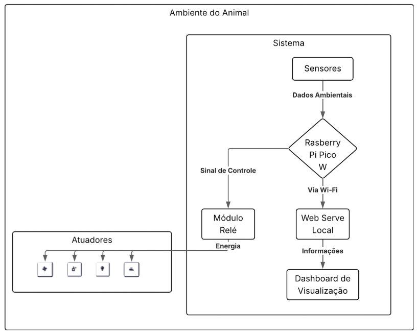
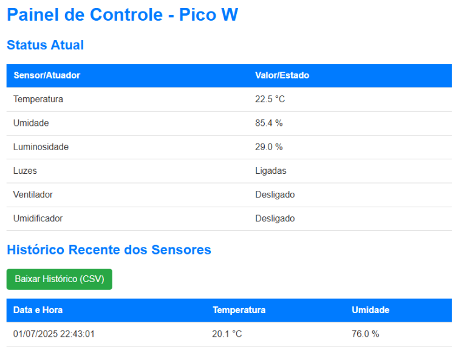
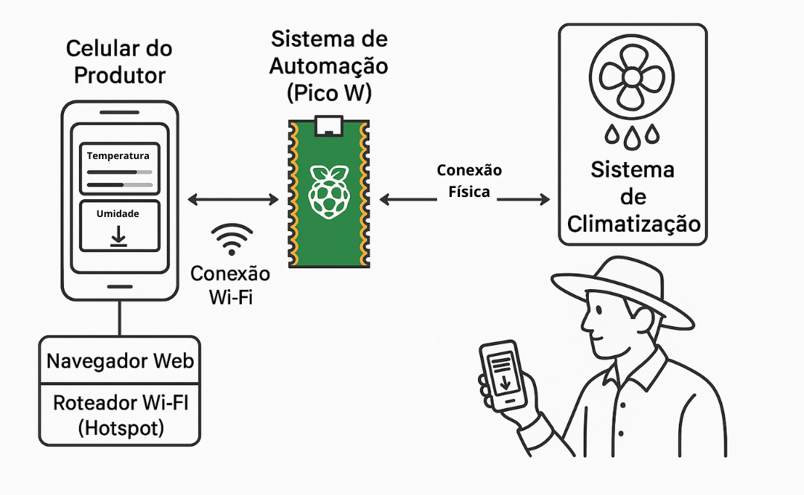

# Automação de Baixo Custo para Pecuária Leiteira no Agreste Potiguar

Projeto de Trabalho de Conclusão de Curso (TCC) apresentado ao curso de Tecnólogo em Análise e Desenvolvimento de Sistemas do IFRN - Campus Nova Cruz.

**Título Completo:** Proposta de Automação de Baixo Custo para Otimização do Bem-Estar e da Produtividade na Pequena Pecuária Leiteira do Agreste Potiguar.

---

## 📖 Índice

- [O Problema](#-o-problema)
- [A Solução Proposta](#-a-solução-proposta)
- [Arquitetura do Sistema](#-arquitetura-do-sistema)
- [Dashboard de Monitoramento](#-dashboard-de-monitoramento)
- [Tecnologias Utilizadas](#-tecnologias-utilizadas)
- [Simulação e Demonstração](#-simulação-e-demonstração)
- [Estrutura do Repositório](#-estrutura-do-repositório)
- [Resultados](#-resultados)
- [Autor](#-autor)
- [Licença](#-licença)

---

## 🎯 O Problema

A pecuária leiteira é uma atividade de grande relevância para a agricultura familiar no Agreste Potiguar. No entanto, a região enfrenta desafios climáticos, como altas temperaturas que frequentemente ultrapassam os 30°C, causando **estresse térmico** no rebanho. Essa condição compromete a saúde dos animais, reduz a ingestão de alimentos e, consequentemente, **diminui a produção de leite**. A maioria dos pequenos produtores possui acesso limitado a tecnologias que poderiam mitigar esses efeitos, devido ao alto custo e à complexidade das soluções existentes no mercado.

## 💡 A Solução Proposta

Este projeto apresenta o desenvolvimento de um **protótipo de automação de baixo custo** para o monitoramento e controle de variáveis ambientais em instalações leiteiras. Utilizando o microcontrolador **Raspberry Pi Pico W**, sensores e atuadores, o sistema é capaz de:

-   🌡️ **Monitorar** continuamente a temperatura, umidade e luminosidade do ambiente.
-   💨 **Acionar automaticamente** sistemas de climatização (ventiladores e nebulizadores) quando a temperatura ultrapassa um limite pré-definido.
-   💧 **Controlar** outros elementos, como bebedouros e iluminação.
-   📊 **Disponibilizar os dados** para visualização pelo produtor através de um painel web local, acessível por celular ou computador, e um display OLED.

O principal diferencial é a viabilidade financeira para o pequeno produtor, com um custo total de implementação de apenas **R$ 283,00**.

## 🏗️ Arquitetura do Sistema

O sistema opera de forma autônoma. Os sensores coletam os dados do ambiente, o Raspberry Pi Pico W os processa e, com base em regras pré-definidas, envia sinais de controle para os módulos relé, que acionam os atuadores (ventiladores, etc.). Paralelamente, o Pico W hospeda um servidor web local que permite ao produtor visualizar os dados via Wi-Fi.

Figura: Diagrama de blocos da arquitetura da solução.

## 🖥️ Dashboard de Monitoramento

Uma interface web simples e objetiva foi desenvolvida para rodar localmente no microcontrolador, permitindo que o produtor acesse as informações em tempo real pelo navegador do celular, conectando-se diretamente ao hotspot do dispositivo.

Figura: Interface web para visualização dos dados.

## 🚀 Simulação e Demonstração

Para visualizar o funcionamento do protótipo, você pode acessar as simulações online nos links abaixo.

-   **Simulação Interativa no Wokwi:** [Acessar Simulação Wokwi](https://wokwi.com/projects/434689530805520385)
-   **Site da Simulação:** [Acessar Simulação Web](https://simulacao-sistema-de-automacao-pecu.vercel.app/)

Figura: Ilustração da arquitetura de implantação em campo.

## 📂 Estrutura do Repositório

O projeto está organizado da seguinte forma:

-   **/docs**: Contém a documentação escrita, incluindo o PDF final do TCC e a apresentação.
-   **/data**: Armazena os dados brutos e resultados da pesquisa de campo realizada com os produtores.
-   **/hardware**: Inclui os diagramas do circuito, a arquitetura da solução e fotos dos componentes utilizados.
-   **/src**: Contém todo o código-fonte em C desenvolvido para o Raspberry Pi Pico W, na qual foi usado dados simulados para realizar a apresentação. Devido a falta de sensores por se tratar apenas de um protótipo inicial.
-   **/assets**: Imagens utilizados neste README.

## ✨ Resultados

A pesquisa de campo com produtores da região validou a percepção sobre os impactos negativos do calor e o grande interesse em uma solução tecnológica acessível. A maioria indicou uma disposição para investir até R$ 500,00, o que valida a viabilidade econômica do protótipo, cujo custo foi de **R$ 283,00**. Os resultados demonstram a viabilidade técnica e econômica da solução, que se apresenta como uma ferramenta prática para mitigar o estresse térmico, promover o bem-estar animal e fortalecer a pecuária leiteira familiar na região.

## ⚙️ Configuração do Ambiente
Para configurar o ambiente e rodar os códigos do Raspberry Pi Pico W, siga este [guia detalhado](docs/setup/getting-started.md).

## 👨‍💻 Autor

-   **João Vitor Alexandre Ribeiro**
-   

**Orientador:** Prof. Msc. Fábio Fernandes Penha

## 📄 Licença

Este projeto está sob a licença MIT. Veja o arquivo [LICENSE](LICENSE) para mais detalhes.
