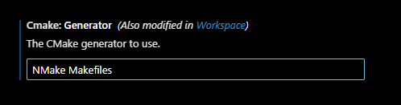

# Tutorial: Instalação do Ambiente de Programação do Pico SDK no VS Code

Este tutorial vai guiar você no processo de instalação do ambiente de programação para o **Raspberry Pi Pico** usando o **Pico SDK** no **VS Code**. 
Por enquanto, apenas consegui embarcar códigos já prontos de outras pessoas pela internet. **OBS**: Sistema operacional Windows e estou considerando que você tem o **C/C++** instalado. 

## Passo 1. Instalar o Visual Studio Code

  
Detalhes

  
   
  
  - Baixe o Visual Studio Code no [site oficial](https://code.visualstudio.com/). 
  - Siga o assistente de instalação para a sua plataforma (Windows, macOS ou Linux). 

## Passo 2. Compilador Arm

  
Detalhes

  
   
  
  - Baixe AArch32 bare-metal no formato .exe (executável). Link: https://developer.arm.com/downloads/-/arm-gnu-toolchain-downloads 
  - Cuidado que no final da instalação é importante você marcar a caixinha declarando que você deseja adicionar as variáveis de ambiente (Add Path to Environment Variable). 
   
  
   
  

## Passo 3. Pico SDK

  
Detalhes

  
   
  
  - Acesse o repositório: https://github.com/raspberrypi/pico-setup-windows/releases/tag/v1.5.1. 
  - Clique em last release na direita inferior. 
  - Baixe a última versão standalone no formato .exe 
  - Abra o instalador como administrador e anote o local da instalação em algum canto. 
  - No final, escolha uma pasta de fácil acesso para você colocar os exemplos (blink, pwm, etc...) para que você possa testar ou aprender. 
   
  
   
  

## Passo 4. Variáveis de Ambiente

  
Detalhes

  
   
  
  - Segure o botão Windows + R. 
  - No campo de texto escreva **sysdm.cpl**, vá em **Avançados** e **Variáveis de Ambiente**. 
  - A partir daqui, você vai encontrar dois campos: um das variáveis do usuário e outro das variáveis do sistema. 
  - Em ambos você vai seguir o mesmo processo: primeiro clique em **Novo**. 
  - Irá aparecer dois campos: 
    - Em **Nome da variável** você irá inserir "PICO_SDK_PATH" (sem aspas). 
    - Em **Valor da variável** você irá inserir o diretório de onde você fez a instalação do pico-sdk (Exemplo: **C:\Program Files\Raspberry Pi\Pico SDK v1.5.1**). 
  - Confirme e, novamente, vamos clicar em **Novo**. 
  - Em **Nome da variável** você irá inserir "PICO_TOOLCHAIN_PATH" (sem aspas). 
  - Em **Valor da variável** você irá inserir o diretório do pico-sdk propriamente dito (Exemplo: **C:\Program Files\Raspberry Pi\Pico SDK v1.5.1\pico-sdk**). 
  - Agora que você fez isso em variáveis de usuário, faça o mesmo processo em variáveis do sistema. 
  - Só faça esse processo caso as variáveis de ambiente ("PICO_SDK_PATH" e "PICO_TOOLCHAIN_PATH") não estiverem listadas. 
   
  
   
  

## Passo 5. Instalação e configuração das Extensões CMake, CMakeTools e Raspberry Pi Pico

  
Detalhes

  
   
  
  - Abra o VSCode, vá no ícone de extensões e instale o **CMake** e **CMakeTools**: 
   
  
   
  
  - O **CMakeTools** precisa ser configurado. Clique na engrenagem que aparece na tela do plug-in e selecione **Settings**. 
  - Procure pelo nome **CMake Path** e confirme que está escrito "cmake" (sem aspas). 
   
  
   
  
  - Logo em baixo está "CMake: Configure Environment". Caso não haja nenhuma linha adicionada, clique em **Add** e adicione o item "PICO_SDK_PATH" (sem aspas) e, em **Value**, o diretório de instalação (Exemplo: **C:\Program Files\Raspberry Pi\Pico SDK v1.5.1**). 
   
  
   
  
  - Agora busque por **generator** e escreva "NMake Makefiles" (sem aspas). 
   
  
   
  
  - De volta ao menu de extensões, procure por **Raspberry Pi Pico** e instale. 
   
  
   
  

## Passo 6. Instalador Zadig, Driver RP2040 para embarcar diretamente pelo VScode

  
Detalhes

   
  
  - Atavés do link: https://zadig.akeo.ie/. Baixe a última versão.  
  - Quando finalizado inicialize o executável como administrador e verifique se o driver em questão está como "RP2 Boot (Interface 1)"
  - Confirme a instalação.

